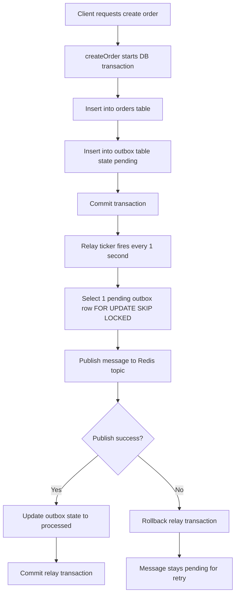
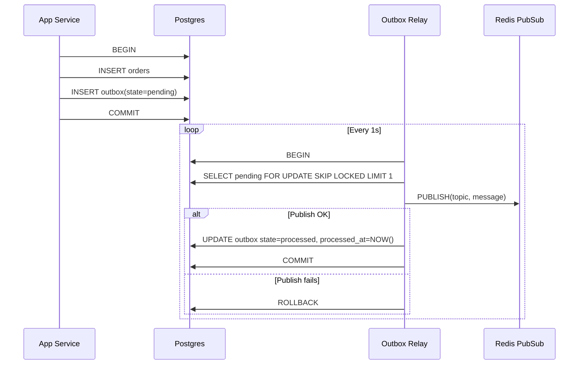

## Outbox Pattern Demo (Go + Postgres + Redis)

This project demonstrates the Outbox Pattern: write business data and integration events in one database transaction, then publish events asynchronously.

In this demo:
- `v2/main.go` writes orders to Postgres.
- It also writes event messages to an `outbox` table in the same transaction.
- A relay process polls pending outbox rows and publishes them to Redis.

## Why this pattern exists

Without outbox, a common bug is:
- Save order in DB succeeds.
- Publish message fails.
- Other services never learn that the order was created.

The outbox pattern prevents that inconsistency by persisting event intent (`outbox` row) in the same transaction as business data (`orders` row).

## Workflow (Step by Step)

### 1. Application creates an order
- `createOrder(...)` starts a DB transaction.
- It inserts into `orders`.
- It creates `OrderCreatedEvent` and marshals JSON.
- It inserts a new row into `outbox` with `state = 'pending'`.
- It commits.

Result: order data and event record are atomically stored.

### 2. Relay continuously checks outbox
- `startRelay(...)` runs every second.
- It calls `relay(...)`.

### 3. Relay locks one pending message
- `relay(...)` starts a transaction.
- It selects one pending row ordered by `created_at`.
- Query uses `FOR UPDATE SKIP LOCKED` to avoid duplicate work across multiple relay workers.

### 4. Relay publishes to Redis
- It publishes the row payload to Redis topic (channel), for example `order.created`.

### 5. Relay marks message as processed
- If publish succeeds, relay updates outbox row to `processed` and sets `processed_at`.
- It commits.

### 6. If publish fails
- Transaction rolls back.
- Outbox row remains `pending`.
- Next relay cycle retries.

## Workflow Diagram

## Sequence Diagram

## Benefits of Outbox Pattern

1. Atomicity for local data and event intent.
2. Reliable retry when broker/network is temporarily down.
3. No distributed transaction required between DB and message broker.
4. Scales relay workers safely with `SKIP LOCKED`.
5. Durable event history for audits and replay.

## Delivery Semantics

This implementation provides at-least-once delivery:
- A message might be published more than once in rare failure windows.
- Consumers should be idempotent (safe to process duplicate events).

## Key Tables

- `orders`: business data.
- `outbox`: integration events to publish.
  - `state = pending` means not published yet.
  - `state = processed` means published and acknowledged by relay.
